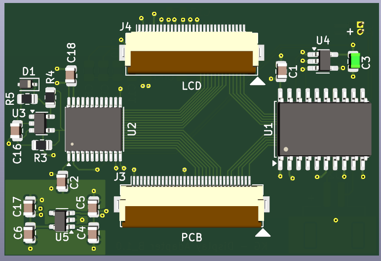
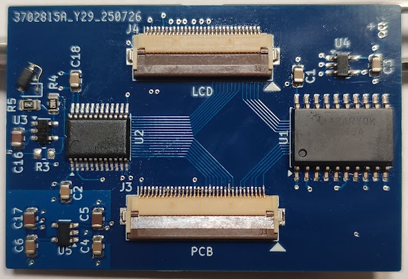
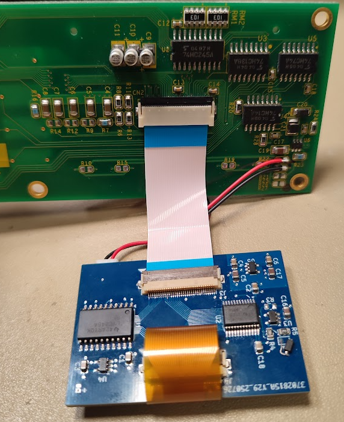
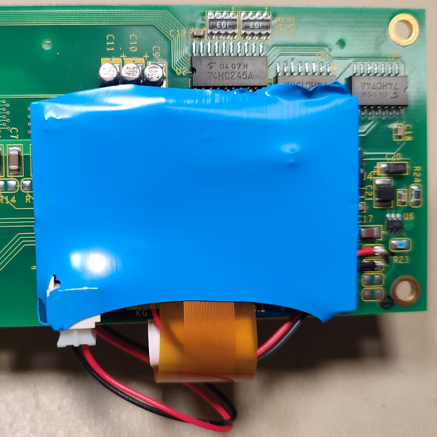

# KG Display Adapter

A KiCAD-designed replacement adapter PCB for Keisoku Giken electronic loads (tested with **ELS-304**, likely compatible with similar models).

## Overview

This adapter allows the use of a modern **3.3V display module** as a replacement for the original LCD.

- **Compatible display:** [NHD-C12864WC-FSW-FBW-3V3](https://www.newhavendisplay.com/nhdc12864wcfswfbw3v3-p-6365.html)
- **Purpose:** Replaces the obsolete LCD and provides a backlight source integrated on the adapter.

## Important Notes

- The new display is slightly thicker; during assembly, the **thin clear protective sheet** originally in front of the display must be **omitted**.
- The **original backlight LED must be removed**.
- The **adapter’s backlight** should be connected using **two wires** to the front panel PCB.

## Images

3D and PCB views of the adapter:

Integration and connection to the front panel PCB and display:

---

This project is shared for educational and hobbyist purposes. Use at your own risk.
